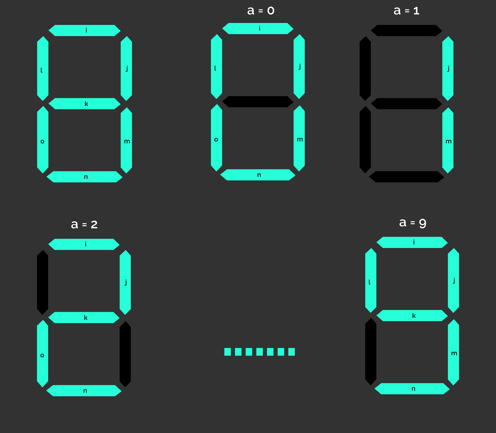

# CircuitQuest Final Round

## How to read the questions
* The names of input and output bits are also given in square brackets after each question.
* $a_0, ...a_3$ means a 4 bit binary number with least significant bit as $a_0$ and most significant bit as $a_3$.
 

## Questions 

1. Given a number $a_0...a_3$ as input, and a 7-segment display containing the inputs as marked in the diagram, display the numbers 0 to 9 (other cases can be ignored) when they are given as input in $a_0...a_3$ (Set a bit corresponding to a segment to light it up)
   
   [Inputs: $a_0...a_3$, Outputs: $i, j, k, l, m, n, o$]

2.   i. Attach a 4-bit (incrementing) counter as the input for circuit in question 1 (starting from 0. ignore cases above 9), given a square wave clock input signal $clk$ 
       [Inputs: $clk$, Outputs: $i, j, k, l, m, n, o$]   
     ii. After counting to 9, return back to 0  
       [Inputs: $clk$, Outputs: $i, j, k, l, m, n, o$]  
     iii. Use two 7-segment displays to count from 0 to 15 
       [Inputs: $clk$, Outputs: $i, j, k, l, m, n, o, a, b, c, d, e, f, g$] ($a$ to $f$ are inputs for the second 7-segment display, segments in the same order as the first one)

4. Given 4, 4-bit numbers $a_0...a_3, b_0...b_3, c_0...c_3, d_0...d_3$ and a 2-bit number $s_0,s_1$ as input, output $o_0...o_3$ should be equal to:  
    $a$ &nbsp; when $s = 0$  
    $b$ &nbsp; when $s = 1$  
    $c$ &nbsp; when $s = 2$  
    $d$ &nbsp; when $s = 3$  
    [Inputs:  $a_0...a_3, b_0...b_3, c_0...c_3, d_0...d_3$, $s_0,s_1$, Outputs: $o_0...o_3$]

5. Given the output from question 3 as input, and $s_0,s_1$ and 4 outputs $a_0...a_3, b_0...b_3, c_0...c_3, d_0...d_3$, for each value of $o_0...o_3$ and $s_0,s_1$, output should be:  
    $a = o$ when $s = 0$ 
    $b = o$ when $s = 1$ 
    $c = o$ when $s = 2$ 
    $d = o$ when $s = 3$ 
    (other outputs should be zero) 
    [Inputs: $o_0...o_3$, $s_0,s_1$, Outputs:  $a_0...a_3, b_0...b_3, c_0...c_3, d_0...d_3$]

 
      
      

