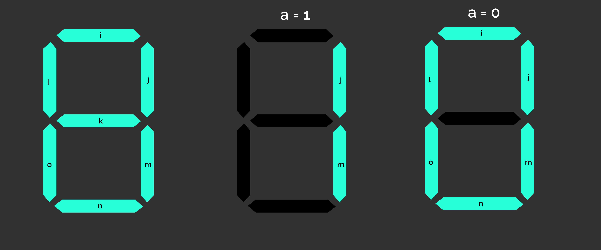

# CircuitQuest Preliminary Round

#### Design a logic circuit satisfying the input and output specified in each question

1. Given a 4 bit number consisting of bits $a_0, a_1, a_2, a_3$ where $a_0$ is the least significant bit, 
   output two bits: 
   bit $x$ = 1 if the given number is odd, otherwise 0 
   bit $y$ = 1 if the given number is even, otherwise 0 

2. Design a logic circuit for the following truth table.
   
   |input|input|output|
   |-----|-----|------|
   |  $a$| $b$ | $o$ |
   |0|0|1|
   |1|0|0|
   |0|1|0|
   |1|1|1|

3. Given a 4 bit number consisting of bits $a_0, a_1, a_2, a_3$, output a 5 bit number $b_0, b_1, b_2, b_3, b_4$ which is twice that of input number, where $a_0$ and $b_0$ are the least significant bit of the input and output number respectively.

4. Design a logic circuit for the following truth table.
   
   |input|input|output|output|
   |-----|-----|------|------|
   |  $a$| $b$ | $c$ | $o$ |
   |0|0|0|0|
   |1|0|0|1|
   |0|1|0|1|
   |1|1|1|0|

5. Given a 4 bit even number consisting of bits $a_0, a_1, a_2, a_3$, output a 3 bit number $b_0, b_1, b_2$, which is the half of the input. $a_0$ and $b_0$ are the least signgicant bit of the input and output number respectively.

6. Design a logic circuit for the following truth table.
   
   |input|input|input|output|output|
   |-----|-----|------|-------|------|
   |  $a$| $b$ | $c_{in}$ | $c_{out}$ | $o$|
   |0|0|1|0|1|
   |0|1|1|1|0|
   |1|0|0|0|1|
   |1|1|0|1|0|
   |0|0|0|0|0|
   |1|0|1|1|0|

7. Given two 4 bit numbers $a_0, ... a_3$ and $b_0, ... b_3$, output a 4 bit number $c_0, ... c_3$ containing the bitwise AND of the two input numbers.
8. The given 7-segment display has 7 binary inputs  (name of each input given within the segment), the segments light up (green) when its input is 1, and the segment is dark when its input is 0. The input for the circuit to be designed is given as $a$. If $a = 0$, display a "0" in the 7-segment display (light up the correct segments), and when $a = 1$, display a "1"

9. A device has 4 buttons to send command to another device. The 4 button states are given as input bits $l, r, u, d$, where the bit is 1 if the button is pressed. Output a 4 bit binary number $o_0, o_1, o_2, o_3$ given that if key $l$ is pressed, output(in base 10) should be 1, if key $r$ is pressed, output should be 2, if $u$ is pressed, output should be 4, if $r$ is pressed, output should be 8. If multiple buttons are pressed at the same time, the output should be the sum of all the numbers corresponding to each button.

10. Given three 4-bit numbers, $a_0, ... a_3$, $b_0, ... b_3$, $c_0, ... c_3$, and three bits $x, y, z$ as input, output a 4-bit number $o_0,...o_3$ which should be equal to: $a_0, ...a_3$ if x = 1, $b_0, ...b_3$ if y = 1, $c_0, ...c_3$ if z = 1. (Other cases of x, y, and z can be ignored)

11. Input is given as a 4 bit number $a_0, ...a_3$, and a parity bit $p$. The parity bit is 1 if the number has odd parity, otherwise 0. Output is a number $o_0, ...o_3$, output should be equal to the input number only if the actual parity and the parity bit matches. Otherwise output all zeroes.

12. Given three numbers n1, n2, n3, the input is given given as three bits containing results of boolean expressions. They are $a = (n1 > n2), b = (n1 > n3), c = (n2 > n3)$. Output is three bits $x, y, z$, in which $x = 1$ if n1 is the largest of three numbers, $y = 1$ if n2 is the largest of three numbers, and $z = 1$ if n3 is the largest of three numbers$

13. A digital signal is transmitted as a differential pair, both transmission lines in the differential pair are active low (meaning, to send a bit 1, the transmission line actually transitions from a high voltage level (1) to low voltage level (0)). The inputs $a, b$ are the transmission line state (active low). The output $o$ is the data being transmitted, which is the magnitude of the difference between the two input signal values.

14. Given two numbers $a_0, ... a_3$ and $b_0, ... b_3$ as inputs, output the number $o_0, ... o_3$ which is the average of the two input numbers (only integer part)

15. 

 
      
      

